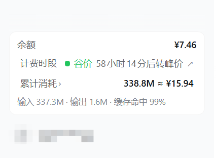
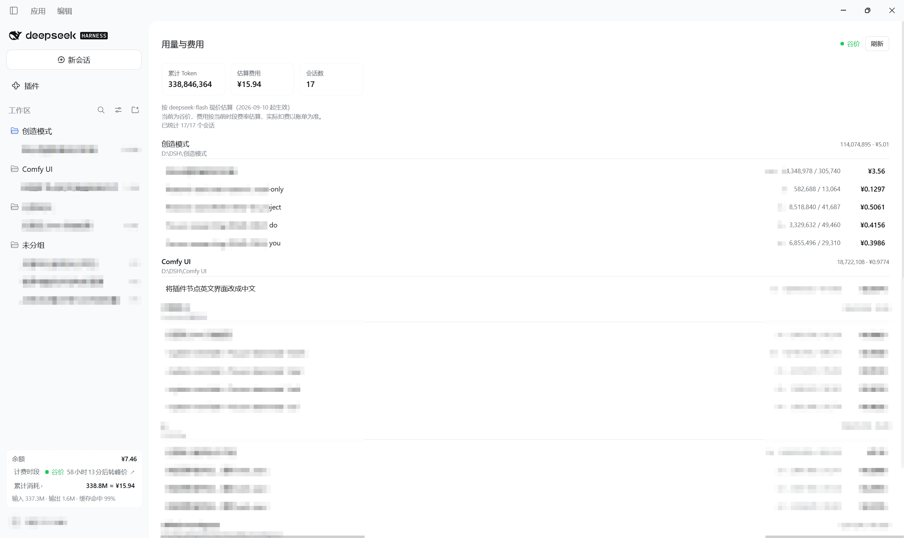

# 计费助手 · Billing Assistant

DSH（DeepSeek Harness）插件：在侧边栏左下角显示**账户余额**、**当前峰价/谷价计费时段**与 **token 消耗**，并提供一个按**目录 / 对话**查看用量与估算费用的面板。

```
┌─ 左下角信息区（入口与余额放在一起）───────────┐
│ 余额                                 ¥9.87     │
│ 计费时段        ● 谷价 59小时10分后转峰价  ↗  │  ← 点击打开官方价格页
│ 累计消耗 ›                     261.2M ≈ ¥13.67 │  ← 点击打开用量面板
│ 输入 259.7M · 输出 1.4M · 缓存命中 99%         │
└───────────────────────────────────────────────┘
```

「用量与费用」面板按**会话真实所在目录**分组：注册过工作区就用工作区名，否则用目录名；每个目录、每个对话都列出 token 与估算费用。子会话（子智能体）按自己的工作目录归组，不再散落进「未分组」。



## 安装

本包同时是 **bundle**（`dsh.bundle` → `cordis.patch.yml`）和**插件本体**（`dsh.client`），因此 DSH「插件」页面可以直接安装它，并显示为「计费助手」。

### 方式一：DSH 插件页面（推荐）

打开侧栏 **插件** → 安装，填入下列任一形式：

| 来源 | 填什么 |
| --- | --- |
| npm | `dsh-plugin-billing-assistant` |

安装后 DSH 会：把包装进 profile 的 `node_modules` → 把包名写入 profile `package.json` 的 `dsh.profile.bundles` → 应用包内 `cordis.patch.yml`（插入 `billing-assistant` 这个 entry）→ 客户端半边自动加载。**无需重启**。

### 方式二：手工（等价写法）

```jsonc
// ~/.dsh/profiles/<profile>/package.json
{
  "dependencies": { "dsh-plugin-billing-assistant": "link:D:/path/to/dsh-plugin-billing-assistant" },
  "dsh": {
    "profile": {
      "bundles": ["@deepseek-ai/dsh-base", "@deepseek-ai/dsh-web-app", "dsh-plugin-billing-assistant"]
    }
  }
}
```

然后在该 profile 目录执行 `pnpm install`（DSH 自带 pnpm）。

### 卸载

插件页面点卸载即可；手工安装则从 `dependencies` 与 `dsh.profile.bundles` 中移除该包名，再 `pnpm install`。

## 数据来源

| 显示项 | 来源 | 说明 |
| --- | --- | --- |
| 余额 | 远程命名空间 `remote.account`：`getState()` + `getBalance(client)` | 远程命名空间是独立 Cordis 服务（`remote.account`），不能用 `ctx.get("remote").account` 取 |
| 峰/谷计费时段 | 本地按北京时间计算 | 规则见下；点击该行打开官方价格页 |
| token 消耗 | 会话投影 `tokenUsage`（`dsh-token-meter`）→ `ctx.sessions.refreshProjections(id)` + 会话目录快照 | 四个桶：未命中输入 / 缓存读取 / 缓存写入 / 输出 |
| 目录与对话 | `ctx.sessions.list`（`cwd`、`displayTitle`）+ `ctx.workspaces.list`（目录标题） | 按 `cwd` 归组 |

## 峰谷定价规则（按官方页面实现）

<https://api-docs.deepseek.com/zh-cn/quick_start/pricing> 原文：

> 空闲时段价格为高峰时段价格的一半。北京时间周一至周五（不含中国法定节假日）9:00 - 12:00、14:00 - 18:00 为高峰时段；其余时段，包括周末及中国法定节假日全天均为空闲时段。

- **峰价**：北京时间 周一至周五（不含法定节假日）`09:00–12:00`、`14:00–18:00`
- **谷价**：其余全部时段，含周末与法定节假日全天；谷价 = 峰价的一半
- 生效：[更新日志 2026-08-13](https://api-docs.deepseek.com/zh-cn/updates)（2026-08-17 00:00 起）；2026-08-23 起周末全天谷价；2026-09-19 官方说明「调休上班的周末、中国法定节假日全天均按空闲时段计费」
- ⚠️ 2025 年那套「每日 00:30–08:30 谷价」**已停止**，不要再用它判断

节假日表来自《国务院办公厅关于2026年部分节假日安排的通知》（国办发明电〔2025〕7号），内嵌在 `lib/client.js` 的 `HOLIDAY_RANGES`。**每年国务院发布新一年放假安排后追加一条即可**（周末本身全天谷价，只需关注落在工作日的假期）。

## 费用估算

DSH 没有费用接口，也没有内置价格表，因此本插件内嵌官方价目（元 / 百万 tokens，2026-09-10 起生效）：

| 模型 | 缓存命中 | 缓存未命中 | 输出 |
| --- | --- | --- | --- |
| `deepseek-flash` | 峰 0.04 / 谷 0.02 | 峰 2 / 谷 1 | 峰 8 / 谷 4 |
| `deepseek-v4-pro` | 峰 0.30 / 谷 0.15 | 峰 9 / 谷 4.5 | 峰 27 / 谷 13.5 |

`未命中输入 × 未命中价 + 缓存读取 × 命中价 + 缓存写入 × 未命中价 + 输出 × 输出价`，再除以 1e6。`tokenUsage` 不带模型信息，故默认按 `PRICE_BASIS.model`（`deepseek-flash`）计价；要换成别的模型改这一个常量即可。历史 token 的发生时段不可知，费用按**当前**峰谷费率估算，界面已注明「实际扣费以账单为准」。

## 目录结构

```
package.json          # dsh.manifestVersion / dsh.bundle / dsh.client / icon
cordis.patch.yml      # bundle 层：insert billing-assistant -> 本包
locale/{zh,en}.json   # 插件列表里的展示名（计费助手 / Billing Assistant）与描述
icon.svg              # 插件列表图标
lib/index.js          # 宿主半边（空实现，仅用于被 Loader 挂载）
lib/client.js         # 浏览器半边：预构建经典脚本 window.__ModuleLoader__.load
docs/                 # 截图
```

浏览器半边按 DSH 约定手写、**无需构建**：只 `require` 平台种子模块（`react`、`react/jsx-runtime`、`@deepseek-ai/dsh-client-ui-primitives`）。它占用的座位：

- `sidebar.footer.action` — 左下角信息区（余额 / 计费时段 / 累计消耗）
- `main`（key `usage-cost`）— 用量与费用面板，由左下角「累计消耗」行打开

## 开发与验证

```powershell
# 校验（158 项断言：峰谷判定 / 节假日 / 费用 / 格式化 / 目录分组 / 注册契约 / 渲染树）
$env:ELECTRON_RUN_AS_NODE="1"
& "<DSH 安装目录>\DeepSeek Harness.exe" "_probe\verify-client.js"
```

`_probe/verify-client.js` 会在 VM 中加载真实的 `lib/client.js`；`_probe/extract.js` 可把 DSH 自带的任意包从 `app.asar` 解出来对照契约。

## 许可

MIT
